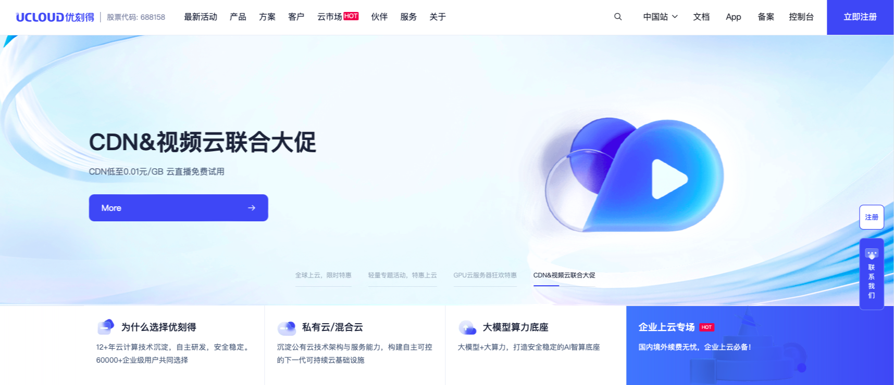
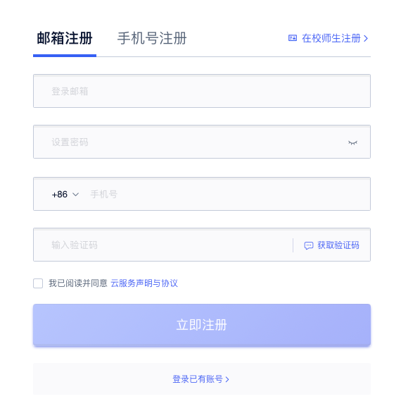
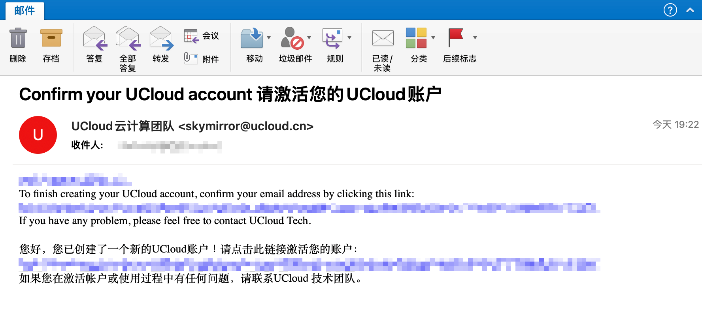
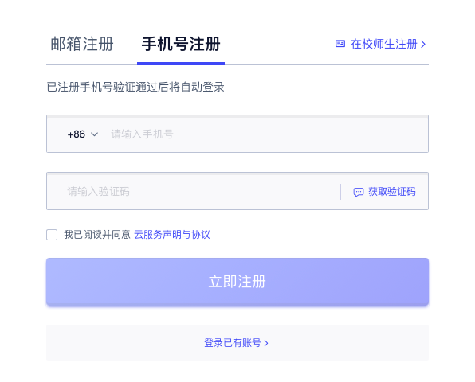
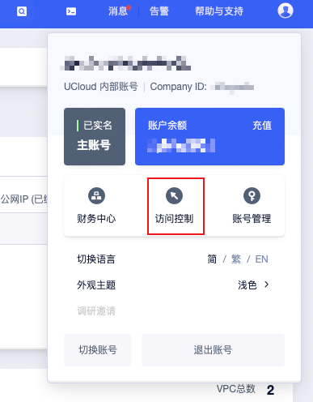
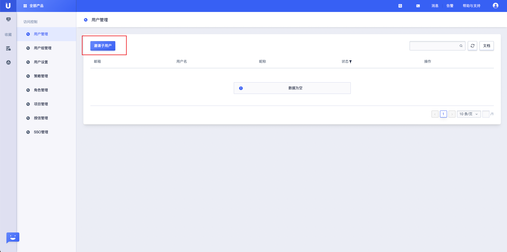
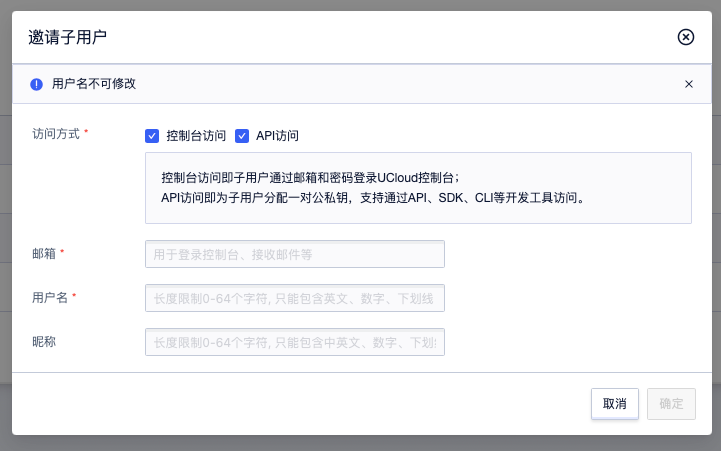
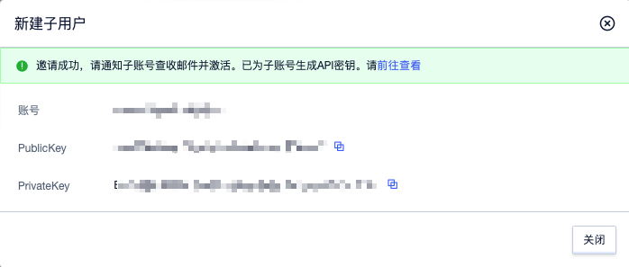
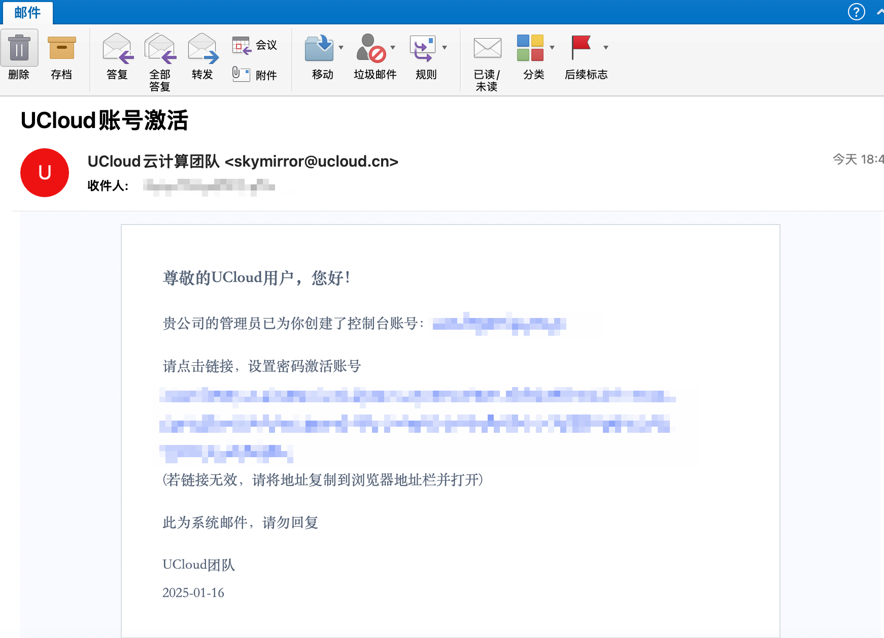
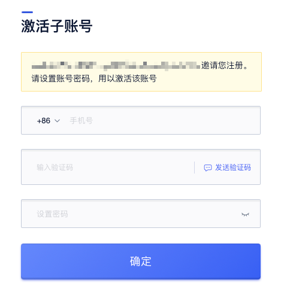

# 注册流程
## 主账号注册
1.进入UCloud首页，点击“立即注册”

2.填写账号信息
- 邮箱注册
  - 设置登录邮箱
  - 设置密码。密码须包含有大小写字母、数字、符号中的两种，密码长度为6-20个字符
  - 输入手机号并提交验证码         

  - 邮箱注册成功，UCloud会发送一封邮件到注册邮箱，请点击邮件内的链接进行激活。该邮箱账号将作为UCloud登录账号

- 手机号注册
  - 请输入手机号和验证码                

3.注册成功，请使用注册时的邮箱和密码，或者手机号，登录UCloud控制台。
 
 
## 邀请子账号
1. 主账号登录控制台，点击右上角的访问控制         

2. 点击“用户管理”，点击“邀请子用户”

3.填写子账号信息
- 选择子账号访问方式
- 填写子账号邮箱、用户名、昵称（选填）

- 显示邀请成功。请通知子账号查收邮件并点击邮件内的链接进行激活。

4.子账号用户点击邮件内的链接进行激活

5.激活子账号
- 输入子账号手机号、验证码
- 设置子账号密码。密码须包含有大小写字母、数字、符号中的两种，密码长度为6-20个字符

6.子账号邀请完成。
