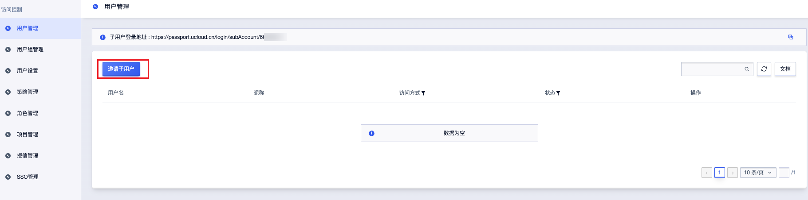
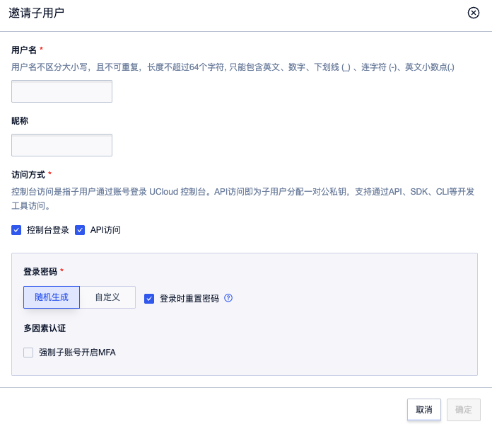

# 子用户管理

## 1. 功能概述

子用户是主账号在 UCloud 平台创建的子账号，用于实现企业内部多人协作、权限隔离与操作审计。

主账号可创建、管理、授权子用户，统一管理资源与费用，子用户仅拥有被授予的资源访问与操作权限，可有效降低主账号密钥泄露风险。
## 2. 前置约束

- 仅**主账号**可创建、管理子用户。
- 子用户**不独立计费**，所有资源与费用归属主账号。
- 子用户支持**控制台登录**与 **API/SDK 调用**。

## 3. 创建子账号

### 3.1 操作步骤

1. 登录 UCloud 控制台，进入 **访问控制 > 用户管理**。
2. 单击邀请子用户
3. 配置子用户信息
     
     

4. 创建成功后，可直接为子用户**绑定用户组**或**添加权限**。
## 4. 子用户登录

### 4.1 控制台登录

1. 访问 UCloud 登录页，选择 **子用户账号登录**。
2. 输入主账号 ID、子用户名、密码。
3. 完成验证后登录控制台。

### 4.2 API/SDK 访问

子用户可创建独立的 **API 密钥（PublicKey / PrivateKey）**，用于调用 UCloud 开放 API，权限与子用户保持一致。

## 5. 子用户权限管理

### 5.1 用户组授权

用户组是一组权限集合，主账号可预设权限组并批量授权给子账号。

### 5.2 精细化权限授权
给子用户单独授权，点击添加权限

#### 

## 6. 子用户管理操作

### 6.1 冻结/注销子用户
- 冻结后子用户将**无法登录**与执行任何操作；若有需要，主账号可以对其解冻，解冻后该账号恢复正常
- 注销后子用户将永久失效，不可恢复，但**主账号下资源不受影响**。
- 适用于员工离职、权限临时回收等场景。
在用户管理中，最后一列操作项，可以选择冻结或注销子用户 

### 6. 2  修改安全邮箱/手机号

主账号可直接重置子用户的安全邮箱/手机号。

### 6.4 管理 AccessKey

支持为子用户创建、禁用、删除 AccessKey，用于 API 调用安全管控。

## 7. 操作日志

子用户的所有操作（登录、资源创建 / 删除、配置变更等）均会被记录到 **操作日志** 中，主账号可随时审计追溯。

## 8. 常见问题

### 8.1 子用户是否可以独立充值？

不可以。所有费用统一计入主账号，由主账户支付。

### 8.2 子用户能否创建其他子账号？

默认不支持，需主账号授予用户管理权限后方可操作。

### 8.3 子用户被禁用后会影响资源吗？

不会影响资源，仅限制子用户的访问与操作能力。

